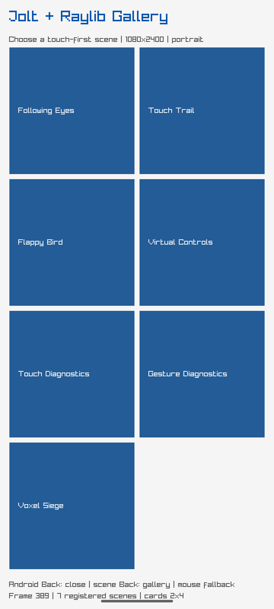

# Raylib Android text and accessibility boundary

The API-35 emulator UI hierarchy was dumped while the NativeActivity gallery was
running. The root exposed a `FrameLayout`/`LinearLayout` surface for package
`net.joltlang.raylibgallery`; no semantic nodes for gallery cards, Voxel
controls, labels, or text fields were exposed. The hierarchy rotation was 0
and bounds covered 1080x2400.

This confirms the current Raylib surface is visually interactive but not a
conventional Android semantic/accessibility tree. No TalkBack or soft-keyboard
support claim is made. Touch target sizing remains a visual responsibility of
the renderer, and future semantic/accessibility work would require a separate
host adapter rather than pretending Raylib text is native Android text.

The screenshot is embedded directly and is the same runtime frame used for the
asset probe; it is visual evidence, not an accessibility success claim.
