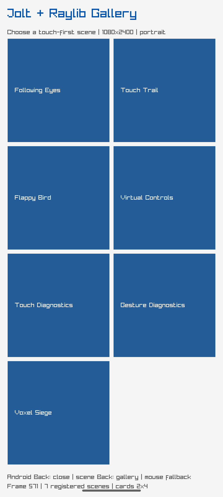

# Raylib asset and storage report

The gallery now carries the same logical asset set in both
`raylib/assets/raylib-gallery/` and the Android APK asset tree:

- `voxel-marker.png` — 8x8 RGBA project marker.
- `DroidSans.ttf` — Droid Sans, Apache 2.0, attributed in `NOTICE`.
- `voxel-state.edn` — deterministic Voxel metadata fixture.

The Android debug APK was rebuilt with the pinned Gradle/SDK toolchain. APK
listing verification found all three assets and the notice:

```text
assets/raylib-gallery/DroidSans.ttf 190776 bytes
assets/raylib-gallery/NOTICE             191 bytes
assets/raylib-gallery/voxel-marker.png    81 bytes
assets/raylib-gallery/voxel-state.edn     84 bytes
APK SHA-256: ec1fc725f91c613b8fac2ea751f0fc17b358caf49c4349135c95b16aee42b9f3
```


The embedded image is a direct emulator capture. An asset-probe APK built with
`-Wl,--wrap=fopen` logged `loaded=1 saved=1 writable-readback=1` on the Android
owner thread, proving packaged EDN access through Raylib's asset wrapper and
writable internal-storage round-trip. A second probe runs after `InitWindow`, loads the PNG and Droid Sans font with
Raylib, checks the expected 8x8 image dimensions and nonempty font texture, and
logged `voxel visual assets=1` on the emulator owner thread. This proves decode
and GPU resource creation; the scene still uses procedural text/cells rather
than the marker/font as its primary visual.




Runtime probe screenshot SHA-256:
`ee01c1f94d4d1b9da8e6a2c5e672b8be2d13eca401e43c76df5df923ee824a54`.

Visual decode screenshot SHA-256:
`e35b549b74b90b333616c4f6f78705a2c4bf5c4509c15011242df2d8e30ef319`.
