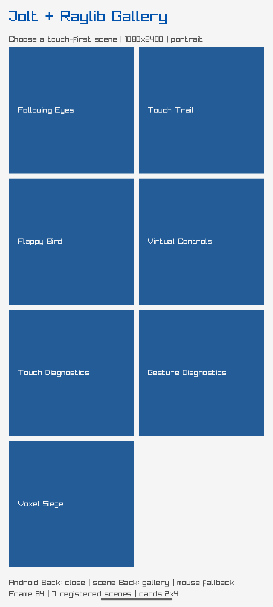

# Raylib alternate-host validation report

This report is separate from the primary Compose/JNI `REPORT.md`. It does not
change the primary host's claims.

## Current level

**R5 bounded / R6 not claimed.** The alternate host has a Jolt-owned Android
NativeActivity frame loop, ARM64 emulator build, touch gallery, Voxel scene
shell, sensor/Box3D/OpenURL probes, lifecycle evidence, and shared pure tests.
A complete production-quality Voxel gameplay renderer, full workload matrix,
physical-device sensor evidence, audio, accessibility semantics and Linux
rendered-frame parity are not proven.

| Level | Result | Evidence |
| --- | --- | --- |
| R0 | pass | Separate Raylib source/dependency pins and host boundary |
| R1 | pass | Android NativeActivity first-frame and owner-thread logs |
| R2 | pass | Jolt-owned Android loop, scalar FFI and ABI probes |
| R3 | pass | Touch gallery, lifecycle, OpenURL, assets and sensor probes |
| R4 | pass | Shared pure scene/model tests and Android screenshots |
| R5 | bounded | Android translated emulator integration with explicit limitations |
| R6 | not claimed | Linux rendered parity, complete Voxel gameplay and full stress matrix remain incomplete |

## Direct visual evidence




The images are embedded directly. Detailed hashes and commands are recorded in
the linked task reports in this directory; those reports also distinguish
reference images from runtime captures.

## Reproduction

```sh
nix develop -c ./scripts/raylib-persistent-loop-build-android debug
cd raylib && nix develop .. -c jolt -M:test
nix develop -c ./scripts/raylib-abi-verify-linux
```

The Android build requires `JOLT_SOURCE` at the pinned Jolt revision. The Voxel
Box3D probe additionally requires the pinned `BOX3D_SOURCE` and `VOXEL_SOURCE`
inputs described in `RAYLIB-VOXEL-SIEGE-ANDROID-PROBE.md`.
