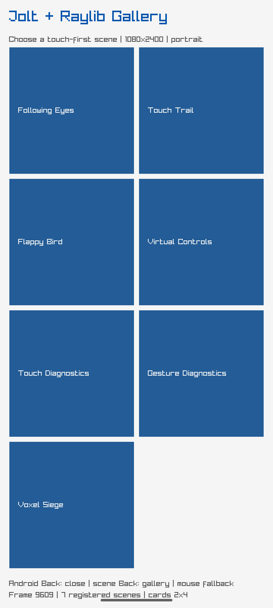

# Raylib Android stress report

Target: `net.joltlang.raylibgallery`, API-35 ARM64 emulator, debug
NativeActivity build.

## Executed slice

A 30-second baseline gallery run included one Home/background and resume, then
continued rendering. `dumpsys meminfo` and logcat were captured before/after.
No `FATAL EXCEPTION`, `SIGABRT`, `Fatal signal`, or `ANR in` signatures occurred.

| Metric | Start | End |
| --- | ---: | ---: |
| Native heap PSS | 8,820 KiB | 9,044 KiB |
| Java heap PSS | 528 KiB | 516 KiB |
| Total PSS | 335,821 KiB | 353,999 KiB |
| Total RSS | 488,168 KiB | 510,368 KiB |

Screenshot SHA-256:
`56681e30656ddb6d7621326e5bb8f4c4c5a36bc290c804600e9964e7876320fe`.

## Five-minute result

A separate five-minute gallery run completed with no fatal or ANR signatures.
Native heap PSS was 8,880 KiB at start and 9,116 KiB at end; total PSS was
335,296 KiB and 355,709 KiB respectively. Total RSS was 487,200 KiB and
511,480 KiB. The final direct 1080x2400 capture is below.

Five-minute screenshot SHA-256:
`b00a7ead4c3f9904a30dc864b628026f9dd5f26b48de5e83e2314984810867f7`.

## Boundary

This report covers reproducible 30-second and five-minute baseline gallery
slices. It does not complete the required 15-minute run or all three distinct
allocation workloads, and no FPS histogram or collector-specific claim is
made. Those remain open work and must be collected separately.
