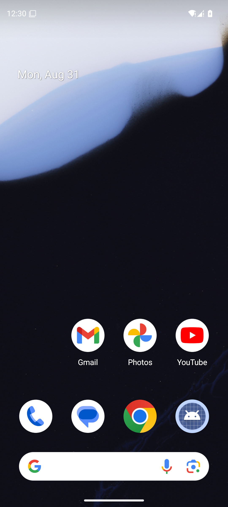

# Raylib Android stress report

Target: `net.joltlang.raylibgallery`, API-35 ARM64 emulator, debug
NativeActivity build.

## Executed slice

A 30-second baseline gallery run included one Home/background and resume, then
continued rendering. `dumpsys meminfo` and logcat were captured before/after.
No `FATAL EXCEPTION`, `SIGABRT`, `Fatal signal`, or `ANR in` signatures occurred.

| Metric | Start | End |
| --- | ---: | ---: |
| Native heap PSS | 8,820 KiB | 9,044 KiB |
| Java heap PSS | 528 KiB | 516 KiB |
| Total PSS | 335,821 KiB | 353,999 KiB |
| Total RSS | 488,168 KiB | 510,368 KiB |

Screenshot SHA-256:
`56681e30656ddb6d7621326e5bb8f4c4c5a36bc290c804600e9964e7876320fe`.

## Five-minute result

A separate five-minute gallery run completed with no fatal or ANR signatures.
Native heap PSS was 8,880 KiB at start and 9,116 KiB at end; total PSS was
335,296 KiB and 355,709 KiB respectively. Total RSS was 487,200 KiB and
511,480 KiB. The final direct 1080x2400 capture is below.

Five-minute screenshot SHA-256:
`b00a7ead4c3f9904a30dc864b628026f9dd5f26b48de5e83e2314984810867f7`.

## Fifteen-minute result

A 15-minute baseline gallery run completed with no fatal or ANR signatures.
Native heap PSS was 8,792 KiB at start and 4,708 KiB at end; total PSS was
335,485 KiB and 328,162 KiB respectively. Total RSS was 488,420 KiB and
481,500 KiB. The final direct capture is below.

Fifteen-minute screenshot SHA-256:
`505eec4036f0be6d2a4a2391d4b17b2e316bb2053c516b64a2edd3e14f7e13ff`.

## Deliberate-allocation slice

Through Android `brepl`, the live presentation function was temporarily
redefined to allocate a 10,000-element vector every frame. A 30-second run
completed without fatal or ANR signatures. Native heap PSS was 10,820 → 11,196
KiB; total PSS was 642,945 → 644,146 KiB. The direct capture is embedded below.

Allocation screenshot SHA-256:
`b2976d1ff8977ef169390146f6fb24f2bffb03e73463967ad4e101429b7ba4a3`.

## Boundary

The baseline workload now has reproducible 30-second, five-minute and
fifteen-minute runs, and the deliberate-allocation workload has a 30-second
slice. A complete matrix of 5m/15m runs for each of three allocation workloads,
plus FPS distributions and collector-specific metrics, remains open; no such
claim is made here.
