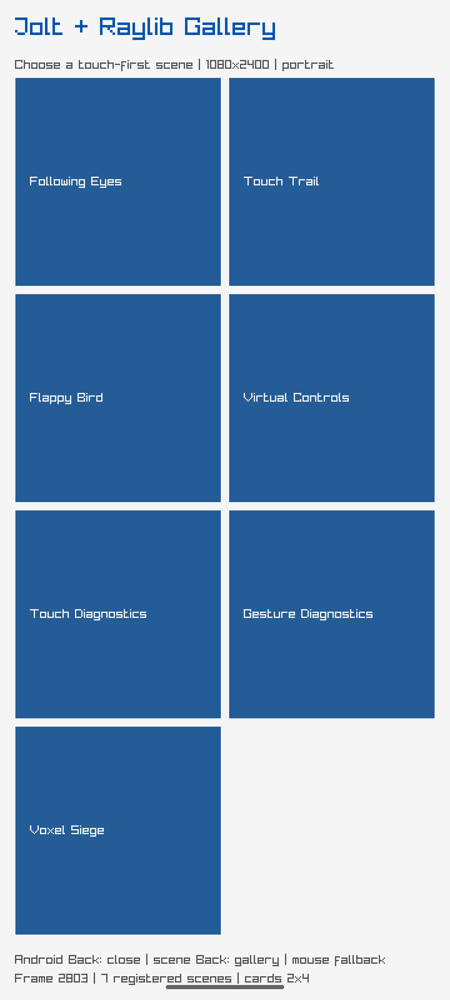

# Voxel Siege gallery scene evidence

The shared Android Raylib gallery now registers Voxel Siege as scene seven. The
scene descriptor requests landscape, while its current host display is still a
pure scene shell pending the Box3D/render adapter.

- Build: `cd raylib/loop-android && nix develop ../.. -c gradle --no-daemon assembleDebug`
- Target: API-35 emulator, `arm64-v8a`
- Launch state: gallery mode, portrait, one NativeActivity/Jolt loop
- Screenshot SHA-256: `d2d39aeeb88c2f6a4077e8777cb614eb07f2c9fa1701438a64ab18f8adb97074`

This screenshot is direct evidence of the current gallery host only. It does
not claim that the Box3D gameplay renderer or landscape transition is complete.
After rebuilding the pinned Jolt library, an emulator tap at `[100 1800]`
selected `:voxel-siege`; the state log recorded `:gallery-mode :scene` and
`:selected-scene :voxel-siege` at frame 69. The live scene screenshot is shown
below.

Live scene screenshot SHA-256:
`cf3f2aba16fb64f74f7e69ec078801d76c5d84a02c6efd92b88457835d2dd67a`.
The scene's pure lifecycle, orientation event and input contracts are covered
by the Raylib test suite: 34 tests, 155 assertions, 0 failures, 0 errors.

The owner-thread nREPL call `(poc.raylib.loop/voxel-set-orientation 1)`
returned `1`. Android display evidence then reported a logical 2400x1080 frame,
and the captured frame below is 2400x1080, proving the NativeActivity helper can
request landscape without creating a second Activity or window.

Landscape screenshot SHA-256:
`a9124b6dd0bab8b1b55ab792607fd81fcc88a5f0325e03622b489c44cac7904e`.
The screenshot is host evidence; the Voxel scene still needs full gameplay
rendering. The owner-thread nREPL call `(poc.raylib.loop/voxel-set-orientation
0)` returned `1`; after the request the display returned to a direct 1080x2400
portrait frame, embedded below.

Portrait screenshot SHA-256:
`a930b3f4062763660234d6a32b65ba21a7f46fc9350ea543129c01fe96e2994b`.
