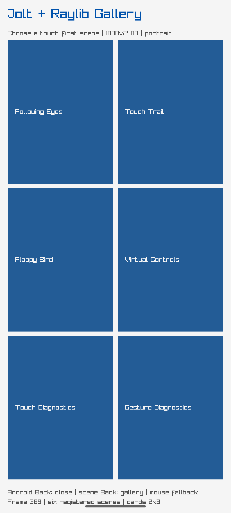

# Voxel Siege gallery scene evidence

The shared Android Raylib gallery now registers Voxel Siege as scene seven. The
scene descriptor requests landscape, while its current host display is still a
pure scene shell pending the Box3D/render adapter.

- Build: `cd raylib/loop-android && nix develop ../.. -c gradle --no-daemon assembleDebug`
- Target: API-35 emulator, `arm64-v8a`
- Launch state: gallery mode, portrait, one NativeActivity/Jolt loop
- Screenshot SHA-256: `d2d39aeeb88c2f6a4077e8777cb614eb07f2c9fa1701438a64ab18f8adb97074`

This screenshot is direct evidence of the current gallery host only. It does
not claim that the Voxel gameplay renderer or landscape transition is complete.
The scene's pure lifecycle, orientation event and input contracts are covered
by the Raylib test suite: 34 tests, 155 assertions, 0 failures, 0 errors.
