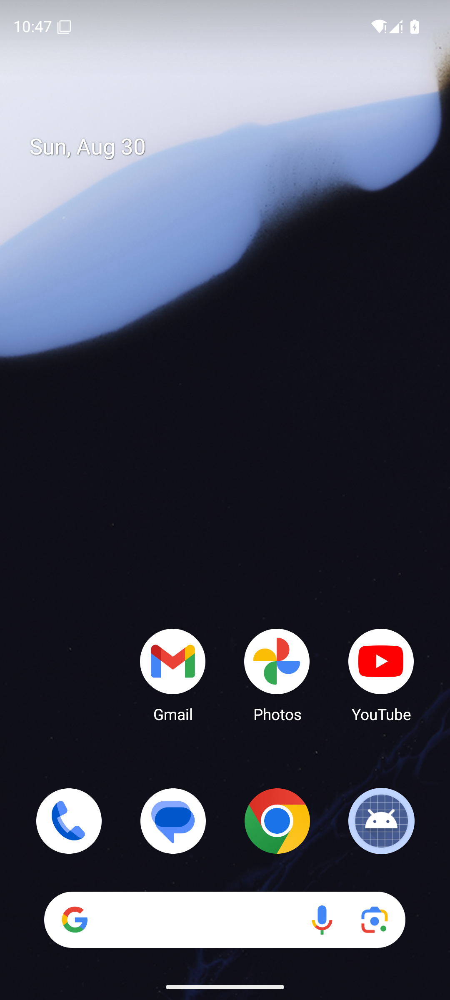
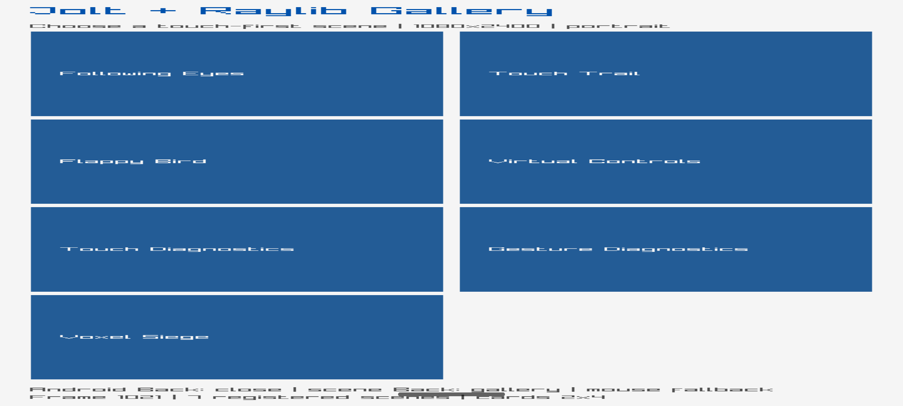

# Voxel Siege gallery handoff

## Result

Voxel Siege is integrated as a separate seventh scene in the existing
single-window Jolt/Raylib gallery. The verified deliverable is a bounded
scene-shell/MVP: deterministic pure rules, touch controls, calibrated
orientation math, owner-thread sensor/Box3D probes, procedural HUD/castle
rendering, Android landscape requests and portrait restoration.

The complete upstream destructible-body flight/impact renderer is not claimed.
Linux graphical parity and physical-device sensor evidence are also not claimed.
These are explicit lower-outcome limitations, not silent substitutions.

## Controls

- Desktop: mouse absolute aim, LMB hold/release charge, `R` reset.
- Android default: playfield drag aims; bottom-right `FIRE` charges/releases;
  top-right `R` resets; bottom-left toggles `AIM MODE`.
- Orientation mode calibrates the current pose on activation. Press/release on
  the non-control surface fires; control hits never fire.
- Back has precedence and returns to the gallery. Scene entry requests fixed
  landscape; scene exit requests portrait. The first transition frame consumes
  pointer input to prevent stale taps.

## Architecture and reproducibility

```text
pure voxel_siege.cljc
  ├─ normalized commands, shot budget, destruction threshold, pose math
  ├─ gallery scene descriptor and orientation metadata
  └─ voxel_physics.cljc callback boundary / pure render plan
       ├─ Jolt owner-thread scalar FFI
       ├─ Box3D + voxel_b3 pointer/scalar shim
       ├─ Raylib NativeActivity orientation/sensor helpers
       └─ existing single gallery window/loop
```

Inputs are pinned in `raylib/pins.edn`: Voxel commit
`9d285987282b26b4dbd14a06838b01ed70c989f1`; Box3D `v0.1.0`, commit
`8441b4a06d6d09dcfb0b0f704df4d847d1437b92`. The supported desktop native
syntax is the vector of named specs; the proposed keyed map was rejected by
pinned Jolt. Android's optional probe links Box3D and the shim into `libmain.so`
for process-symbol lookup. Distribution remains gated on durable author Voxel
permission/license evidence; see `RAYLIB-VOXEL-SIEGE-PROVENANCE.md`.

## Validation

```sh
nix develop -c ./scripts/raylib-verify
cd raylib && nix develop .. -c jolt -M:test
./gradlew test
```

The Raylib suite currently passes 38 tests and 170 assertions. Reports with
commands, direct screenshots, hashes and limitations:

- `RAYLIB-VOXEL-SIEGE-BASELINE.md`
- `RAYLIB-VOXEL-SIEGE-ANDROID-PROBE.md`
- `RAYLIB-VOXEL-SIEGE-SCENE.md`
- `RAYLIB-VOXEL-PERFORMANCE.md`
- `RAYLIB-ASSETS-REPORT.md`
- `RAYLIB-LIFECYCLE-REPORT.md`
- `RAYLIB-REPORT.md`





The screenshots are embedded directly; they are runtime emulator captures and
are not runtime game assets.
