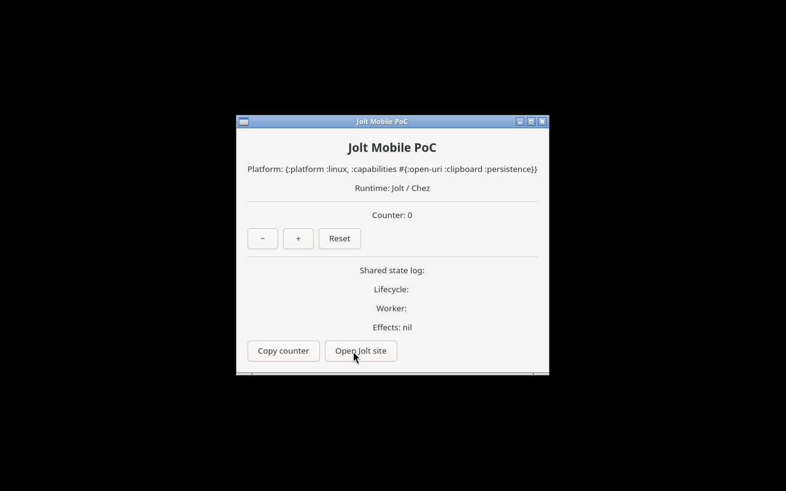
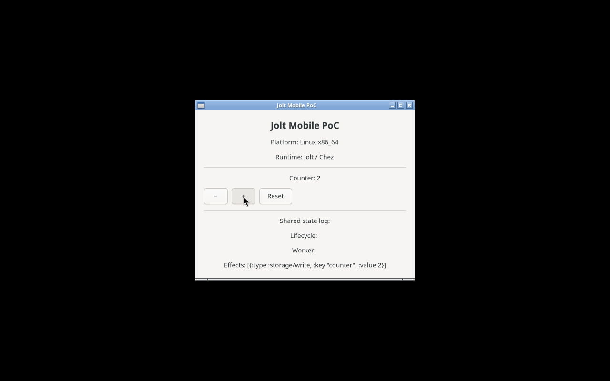
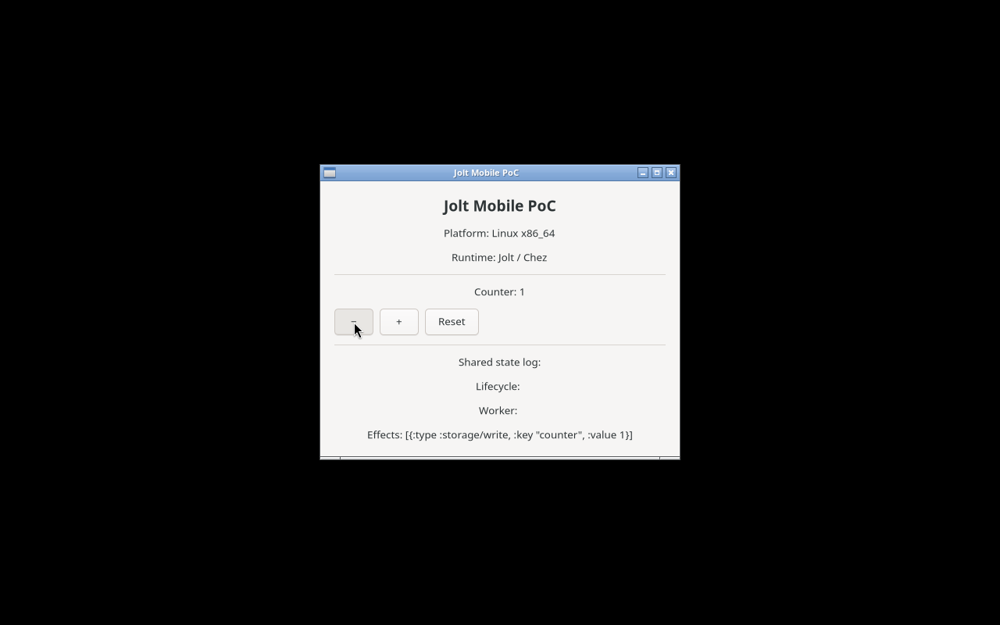
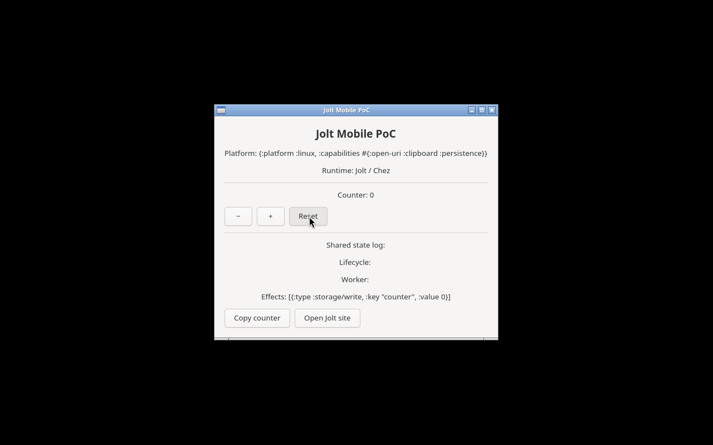
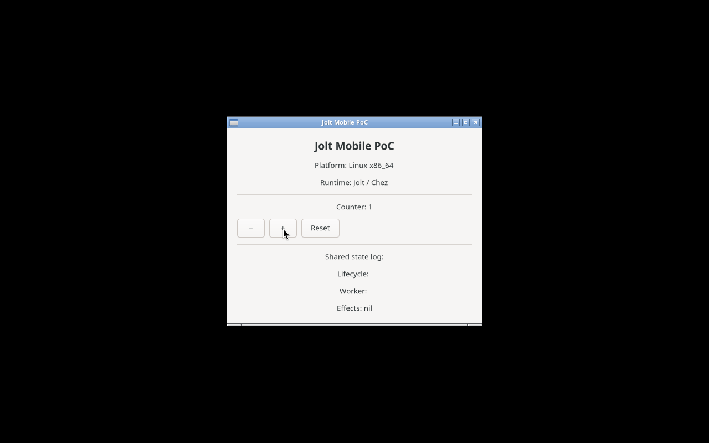

# x86_64 Linux GTK reference-host validation

## Problem

Establish that the active Fedora Lima guest can run the Jolt/Glimmer/GTK4
reference path through the project-pinned Nix shell. This is evidence for the
Linux GTK reference host only; it is not native ARM64 Linux evidence.

## Environment

- Fedora 44 Cloud Edition Lima guest, `x86_64`
- kernel: `6.19.10-300.fc44.x86_64`
- Nix `2.34.8`
- pinned Jolt `8fcba79f8b33628af926f88032d93a1b31c24235`
- GTK `4.22.4`; GLib `2.88.3`
- managed `Xvfb :99` / Openbox desktop
- glimmer-gtk `ce79d45698d36ccf496397bb85974e3cce6abfd8`

## Reproduction

From the repository root:

```sh
DISPLAY=:99 nix --extra-experimental-features 'nix-command flakes' develop -c \
  ./experiments/EXP-021-x86-64-linux-gtk-host/commands.sh
```

The command verifies that the shell exposes GTK/GLib to Jolt FFI, clones the
pinned upstream GTK backend into a temporary directory, runs its headless unit
suite and its live GTK reactivity smoke, then runs this repository's shared
portable suite.

Launch the reference host with:

```sh
DISPLAY=:99 nix --extra-experimental-features 'nix-command flakes' develop -c \
  ./scripts/gtk-run
```

## Expected

The GTK FFI libraries resolve from the pinned Nix environment, the Glimmer GTK
smoke reports `:result :pass`, and the shared portable suite stays green.

## Actual

See [the observed results](actual.md). The upstream GTK tests passed (six tests and 24
assertions), the live GTK reactivity smoke passed, and the shared project suite
passed (seven tests and 16 assertions). The project reference host rendered the
shared counter and actual GTK interactions exercised increment, decrement, and
reset. It executes the reducer's `:storage/write` effect through a host-side EDN
file, and a fresh launch restored the persisted counter. Screenshots and launch
logs are retained under `artifacts/`.

## Visual evidence











## Boundary

This proves the current native `x86_64-linux` GTK reference environment. It
does not provision or validate the separately required native ARM64 Linux host,
nor does it prove Android or macOS GTK support.
