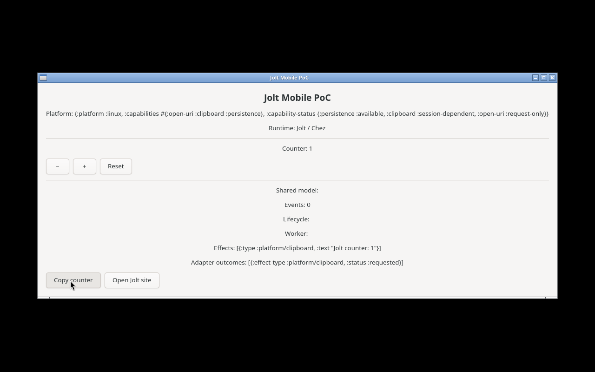
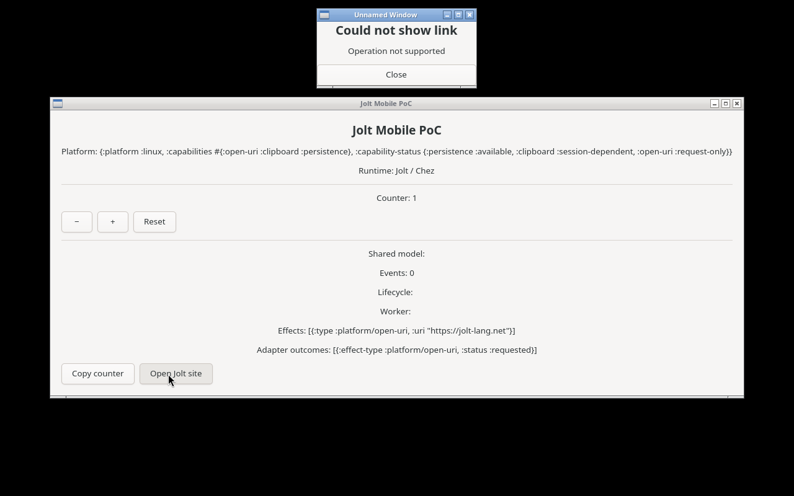

# Observed 2026-08-29; revalidated 2026-08-30

The active host is a resource-capable native Linux (not emulated) x86_64 Fedora
44 Lima guest:

```text
Linux lima-jolt-android 6.19.10-300.fc44.x86_64
x86_64
Nix 2.34.8
Jolt ae5c5a6d5be263a883e9b4b53f255b8c0b493d3e
GTK 4.22.4
GLib 2.88.3
DISPLAY=:99
```

The guest's managed `lima-x11.service` had Xvfb, Openbox, and x11vnc running.
The project Nix shell now supplies GTK4/GLib on Linux and sets
`LD_LIBRARY_PATH` to the Nix library paths required by Jolt's `dlopen`-based
FFI resolution.

The reproducible command in `commands.sh` checked out the exact upstream
`glimmer-gtk` revision `ce79d45698d36ccf496397bb85974e3cce6abfd8` into a
temporary directory. The current project portable suite, GTK adapter suite,
live GTK reactivity smoke, and off-thread/nREPL scheduling smoke were rerun on
this host after separating model and adapter state:

```text
Ran 6 tests. 24 assertions passed, 0 failures, 0 errors.
:smoke :result :pass :render-count 2
SMOKE OK (repl-live)
Ran 3 tests. 10 assertions passed, 0 failures, 0 errors.
Ran 10 tests. 30 assertions passed, 0 failures, 0 errors.
GTK reference interaction screenshots written to artifacts/screenshots/exp021-gtk-*.png
```

The GTK smokes emitted warnings about the C locale, unavailable desktop portal,
and unavailable Vulkan devices inside the intentionally minimal Xvfb desktop.
They still completed the live reactive render and worker-to-main-loop scheduling
sequences successfully. These warnings do not represent GTK FFI or Glimmer
failures.

The project reference application launched through `DISPLAY=:99 ./scripts/gtk-run`.
`artifacts/screenshots/exp021-gtk-initial.png` shows the shared model at
`Counter: 0`; `artifacts/screenshots/exp021-gtk-incremented.png` shows two
actual GTK `+` clicks yielding `Counter: 2`; and
`exp021-gtk-decremented.png` / `exp021-gtk-reset.png` show the shared reducer
returning to `Counter: 1` and `Counter: 0`, respectively. Each non-initial
state displays the declarative reducer output, for example:

```text
Effects: [{:type :storage/write, :key "counter", :value 1}]
```

The GTK adapter executes that `:storage/write` effect through a host-side EDN
file and then relaunches the app. `exp021-gtk-restored.png` shows that the
persisted `Counter: 1` was restored into the shared model after the restart.
It advertises implemented capabilities separately from their operational status:
`:persistence` is available, clipboard is session-dependent, and open-URI is
request-only. The adapter invokes GTK's
`gdk_clipboard_set_text` for `:platform/clipboard` and `gtk_show_uri` for
`:platform/open-uri`; `exp021-gtk-clipboard.png` and
`exp021-gtk-open-uri.png` retain the corresponding reducer effect data after
real GTK button interaction. The latter capture also records the minimal Xvfb
desktop's exact limitation: GTK displayed **Could not show link — Operation not
supported**, because no desktop portal/browser handler is installed. The
Jolt/GTK process remained live after the call. The adapter outcome is therefore
`:requested`, not `:completed`; this is an observed headless host integration
limitation, not evidence that the URI opened.

Persistence restore now enters through the reducer's `:storage/restore` event,
and rendering consumes `poc.reducer/view-model`. Reducer state and adapter
outcomes use separate reactive cells. The adapter commits a pure model transition
before effect execution, catches effect failures as diagnostics, and never rolls
the model back. It intentionally has no GTK widget, Android object, native
pointer, last-effect value, or adapter outcome in reducer state. The result is native x86_64 Linux evidence only and does not
satisfy the independent native ARM64 Linux-host requirement in
`jolt-android-jkb.2`.

## Visual evidence

### Initial state


### Incremented state


### Decremented state


### Reset state


### Restored state


### Clipboard effect



### URI effect boundary


