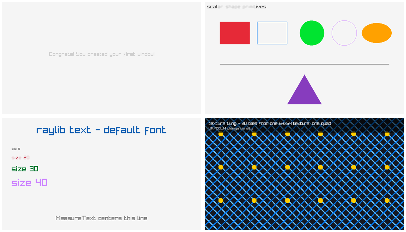

# raylib-jlt x86_64 Linux desktop baseline

## Problem

Determine whether the exact pinned Jolt, raylib-jlt, and Raylib combination can
compile all upstream binding namespaces and render representative desktop
examples before Android work begins.

## Environment

Observed on 2026-08-29 in the current x86_64 Fedora Lima guest:

- Jolt `ae5c5a6d5be263a883e9b4b53f255b8c0b493d3e`;
- raylib-jlt `15c4c6d5757c5c592983166626fd32341c6fc45e`;
- Raylib `9f3cadf1e618f125bd9b282c7759f8cb26ce17fc`, whose header reports
  `6.1-dev` and whose package metadata reports `6.0.0`;
- Nix-provided Raylib, Jolt, Mesa and ImageMagick; and
- the managed host Xvfb display `:99`, with Mesa llvmpipe/OpenGL 4.6.

See [`environment.txt`](environment.txt) for captured values,
[`revision.txt`](revision.txt) for the detached revision verified by the
reproduction script, and [`logs/clone.log`](logs/clone.log) for its checkout.

## Minimal reproduction

Run the commands in [`commands.sh`](commands.sh) from the repository root:

```sh
nix --extra-experimental-features 'nix-command flakes' develop -c \
  ./experiments/RAY-001-raylib-jlt-linux-baseline/commands.sh
```

The script makes a disposable, detached checkout of the pinned binding source,
runs the upstream headless `:check` alias, then starts selected windowed aliases
with automatic exit and one frame screenshot each.

## Expected

- every binding namespace compiles without a display;
- the basic window, scalar primitives, text, keyboard-input, and texture paths
  initialize real GLFW/X11/OpenGL and write inspected screenshots; and
- a 2D camera path either renders a recognizable world or yields a reduced,
  architecture-specific ABI result.

## Actual

The headless compile gate passed:

```text
net.b12n.raylib-jlt: all example namespaces compiled OK
```

The basic, input, shapes, text, and texture-tiling aliases each initialized
Raylib's desktop GLFW/X11 backend, an OpenGL 4.6 llvmpipe context, and produced
an 800×450 PNG before automatic clean shutdown. The texture log specifically
reports successful loading of a `64x64` RGBA texture. The internal Raylib
screenshot helper flushed the active batch before capture, so these are rendered
frames rather than merely process-exit evidence.

The pinned binding has no `:audio` alias and no `InitAudioDevice`/
`PlaySound` declarations, so the requested audio attempt was not silently
substituted: [`logs/audio.log`](logs/audio.log) records the explicit undeclared
alias failure. Audio remains unproven and belongs to the later optional audio
probe.

The `camera2d` alias exited and wrote a PNG, but the inspected image contains
only its screen-space HUD/center line; its world geometry is absent. This matches
the upstream documentation: its `BeginMode2D(Camera2D)` binding passes a pointer
for a 24-byte by-value aggregate, a technique documented as AArch64-only and
invalid on x86_64 System V. This is classified as
`RAYLIB_JLT_BINDING` / x86_64 aggregate-ABI behavior, not a failure of the
scalar first-frame binding path. The later Android AArch64 ABI task must test it
there; do not use this pointer workaround as x86_64 portability evidence.

## Visual evidence

The agent inspected the contact sheet below. It shows legible basic-window text,
colored scalar primitives, differently sized/color text, and a textured grid.



The individual PNGs and their hashes are retained in [`screenshots/`](screenshots/).
[`image-inspection.txt`](image-inspection.txt) records PNG type, dimensions, and
pixel means. The inspected camera result is retained separately as
[`screenshots/camera2d.png`](screenshots/camera2d.png).

## Nix/Xvfb observation

Nix Raylib/GLVND initially failed against the existing host-managed Xvfb with
`GLX: No GLXFBConfigs returned`. The Nix Xvfb test similarly had no usable GLX
configuration. The successful real-window run prepended `/lib64` to
`LD_LIBRARY_PATH`, selecting the host GLVND/Mesa implementation already serving
that managed display while retaining the pinned Nix Raylib/Jolt binaries. This
is a documented Linux visual-host compatibility boundary, not Android evidence
and not a replacement for the pinned Raylib library. The headless compile check
does not need it.

## Boundary

This establishes the pinned scalar Jolt → FFI → Raylib desktop path on this
native x86_64 Linux host. It does not establish Android loading, Android EGL,
AArch64 aggregate ABI, audio, or a fully Nix-self-contained visual X server.
