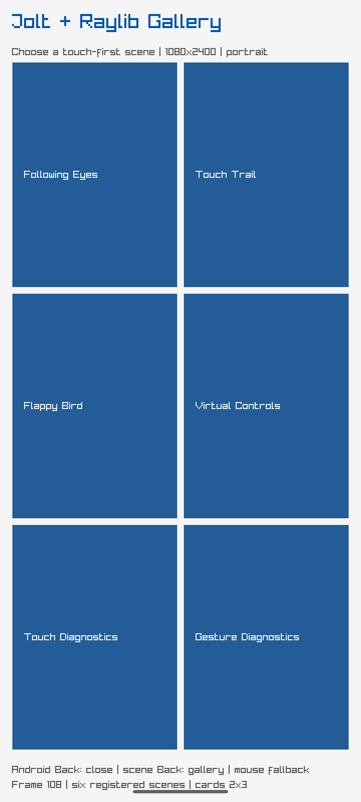
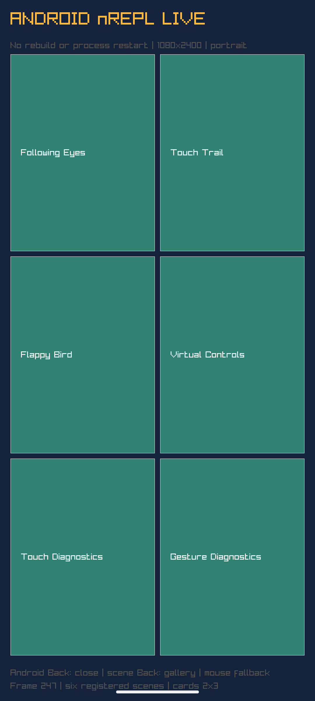
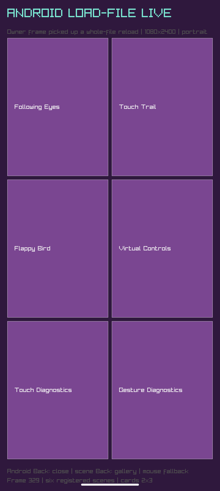

# Android Jolt nREPL with the Raylib owner loop

## Result

**Passed on the API-35 x86_64 emulator executing the ARM64 gallery through
Android translation.** The Raylib debug APK now starts Jolt's minimal bencoded
nREPL server on Android loopback port 7888. ADB forwarding exposes it only to
the development host. `describe`, `clone`, `eval`, `load-file`, and `close`
returned standard nREPL responses while the Raylib window continued rendering.

Two changes reached the already-running window without an APK build, install,
Activity restart, or process restart:

1. `eval` replaced the pure `poc.raylib.gallery-ui/live-presentation` Var. The
   next owner frame rendered a dark blue/green “ANDROID nREPL LIVE” gallery.
2. `load-file` sent [`poc/raylib/gallery_ui.clj`](poc/raylib/gallery_ui.clj)
   from the host. The next owner frame rendered the purple “ANDROID LOAD-FILE
   LIVE” gallery.

The Android PID remained unchanged across both replacements. Runtime state
advanced from `:presentation :baseline` to `:android-nrepl-v2` and then
`:android-load-file-v3`. The four inspected screenshots are retained in
[`evidence/`](evidence/) with SHA-256 hashes.

The script then sent Android Home, queried the same nREPL while the Activity was
backgrounded, resumed the NativeActivity, queried it again, and captured the v3
frame. Both responses retained `:android-load-file-v3`, and the process ID was
unchanged across background/resume.

A deliberate exception returned `eval-error`; the next request returned `42`,
so a bad form did not poison the process. Fifteen pure tests and 77 assertions
passed, including the bounded owner-queue contract.

## Screenshot evidence

These ADB framebuffer captures show the same running gallery before and after
REPL-driven changes. The presentation, colors, and title change without a
rebuild or process restart; the resumed capture confirms the loaded presentation
survives Android Home/background and NativeActivity resume.

### Baseline



### After `eval` redefinition



### After `load-file`



### After background/resume


## Thread boundary

The Raylib/Jolt frame owner reported Jolt/Chez thread ID `0`; nREPL evaluation
reported worker ID `5`. nREPL workers may compile definitions and inspect pure
state, but they must never invoke Raylib drawing, input, window, resource, or
lifecycle FFI directly.

For a bounded one-off operation that genuinely requires Raylib, the debug
namespace exposes `submit-owner!` and `owner-result`. The queue accepts at most
16 pending requests, the frame loop executes at most one request between frames,
and only the 64 newest results are retained. The experiment queued
`GetScreenWidth` from nREPL; the response first returned `{:status :queued}` and
then reported `{:screen-width 1080 :execution-thread-id 0}`. Thus the nREPL
worker stored a closure and the Raylib owner performed the FFI call.

This queue does not make arbitrary blocking work safe: submitted functions must
remain short and bounded. Prefer redefining pure functions that the frame owner
calls naturally. Use the queue only for an owner-affine observation or command.

## Development workflow

Build and install the dynamically routed debug image once:

```sh
JOLT_SOURCE=/path/to/pinned-jolt \
  nix --extra-experimental-features 'nix-command flakes' develop -c \
  ./scripts/raylib-persistent-loop-build-android debug

nix --extra-experimental-features 'nix-command flakes' develop -c \
  adb -s emulator-5554 install \
  raylib/loop-android/build/outputs/apk/debug/raylib-loop-android-debug.apk

nix --extra-experimental-features 'nix-command flakes' develop -c \
  adb -s emulator-5554 shell am start -n \
  net.joltlang.raylibgallery/android.app.NativeActivity
```

Forward the nREPL port for an editor:

```sh
nix develop -c ./scripts/raylib-android-nrepl forward
# connect a generic nREPL client to 127.0.0.1:7888
```

Or use the deterministic command client:

```sh
nix develop -c ./scripts/raylib-android-nrepl describe
nix develop -c ./scripts/raylib-android-nrepl \
  eval '(current-runtime-state)' poc.raylib.loop
nix develop -c ./scripts/raylib-android-nrepl \
  load-file raylib/src/poc/raylib/gallery_ui.cljc
```

The built-in server is the standard minimal Jolt nREPL surface. This experiment
did not package or validate optional CIDER middleware, completion beyond the
built-in operation, interruptible evaluation, or concurrent editor sessions.

### What normally needs no restart or rebuild

- pure `def`/`defn` changes in already loaded namespaces;
- shared reducers, state transforms, layout, animation, and input interpretation;
- a drawing function definition, provided evaluating the definition itself does
  not call Raylib and the frame loop resolves its Var dynamically;
- whole-file source sent through `load-file`;
- pure state inspection; and
- short owner-affine probes submitted through the bounded queue.

### What still requires a rebuild or lifecycle restart

- C/NativeActivity, Gradle, manifest, ABI, or Raylib native-library changes;
- adding native symbols or changing FFI signatures/topology;
- packaged Android resources/assets and permissions;
- changes to definitions captured as values at startup instead of called through
  Vars;
- structural initialization that has no explicit stop/reset/reinitialize seam;
- release validation and every production artifact.

The debug Jolt library is built from the separate
`poc.raylib.loop-debug` entry with `--dev`, preserving Var routing and adding the
nREPL export. The release library builds from `poc.raylib.loop`, remains
direct-linked, and does not contain the `raylib_gallery_debug` export.

## Security and release exclusion

The server binds `127.0.0.1` only and is reachable from the host through an
explicit `adb forward`. Android requires `android.permission.INTERNET` even for
this loopback socket, so that permission exists only in
`raylib/loop-android/src/debug/AndroidManifest.xml`.

The separately built release APK:

- had no `INTERNET` permission;
- selected `raylib_gallery` with `mode=release`;
- contained neither the debug nREPL selection in `libmain.so` nor the
  `raylib_gallery_debug` export in its Jolt image;
- emitted no nREPL-start log; and
- did not answer the forwarded nREPL probe.

The release process was validated from a disposable locally signed copy; no key
or signed artifact was retained.

## Reproduce and evidence

Run the complete gate:

```sh
JOLT_SOURCE=/path/to/pinned-jolt \
  nix --extra-experimental-features 'nix-command flakes' develop -c \
  experiments/RAY-017-android-raylib-nrepl/commands.sh
```

Important evidence:

- [`describe.jsonl`](evidence/describe.jsonl): advertised minimal nREPL ops;
- [`thread-boundary.jsonl`](evidence/thread-boundary.jsonl): worker `5`, owner `0`;
- [`owner-queue-submit.jsonl`](evidence/owner-queue-submit.jsonl) and
  [`owner-queue-result.jsonl`](evidence/owner-queue-result.jsonl): queued
  owner-thread Raylib FFI result;
- [`process-identity.txt`](evidence/process-identity.txt) and
  [`background-resume-process.txt`](evidence/background-resume-process.txt):
  unchanged PID through reload and lifecycle transitions;
- [`state-before.jsonl`](evidence/state-before.jsonl),
  [`state-v2.jsonl`](evidence/state-v2.jsonl), and
  [`state-v3.jsonl`](evidence/state-v3.jsonl): frame-observed revisions;
- [`eval-error.jsonl`](evidence/eval-error.jsonl) and
  [`eval-recovery.jsonl`](evidence/eval-recovery.jsonl): failure isolation;
- [`release-permissions.txt`](evidence/release-permissions.txt),
  [`release-jolt-debug-export.txt`](evidence/release-jolt-debug-export.txt),
  [`release-runtime.log`](evidence/release-runtime.log), and
  [`release-nrepl-probe.txt`](evidence/release-nrepl-probe.txt): release
  exclusion; and
- [`result.txt`](evidence/result.txt): complete gate result.

This proves the translated-emulator workflow. It does not prove a native ARM64
Android device, full CIDER compatibility, safe arbitrary eval, or production
remote-code execution.
